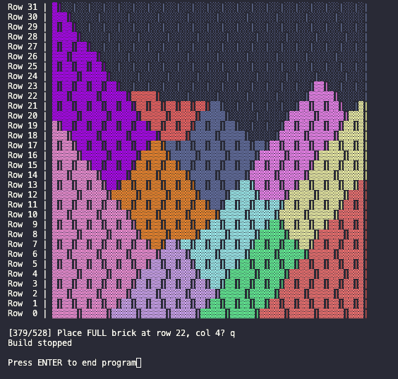

# Wall Visualizer
## Overview

This C++ program optimizes the build sequence for a brick-laying robot. It uses A* pathfinding to determine the optimal order and robot positions for placing bricks while respecting structural constraints; bricks must be fully supported from below.

A movement has cost 1 and placing a brick from current position has cost 0. With A* this unfolds to greedy brick placement and finding a path where you maximize amount of bricks you place while minimizing robot movements. This is because A* selects the path that minimizes: $$f(n) = g(n) + h(n)$$ It tries to reduce total cost $f(n)$. Building bricks from current position has $g(n) = 0$ + a heuristic $h(n)$; a lower bound for the estimation of total cost remaining. A very low bound for the heuristic would be remaining area to build divided by envelope area, which is admissible. The heuristic $h(n)$ is constant for each state with an added brick for walls consisting of same type bricks. It does not matter if you place a brick at position A or position B, heuristic is the same if the added brick is same size.
Moving to a different robot position increases cost since $g(n) = 1$, $h(n)$ does not change since the wall state does not change.

Since there were too many states (a state consists of robot position and wall state) with equally good estimated remaining costs $h(n)$, keeping it pure A* would take too much time to run the program. In the height you can remove lots of positions where you can not build any brick because there is no support yet, but in width this is not possible so with wider walls there are more horizontal robot positions to consider.

That is why I made the code such that brick placement is always greedy. A* tries to find the path which will maximize the most bricks built in least movements as possible. The robot positions are pruned to speed things up. Vertical positions that can not build anything due to lack of support are dismissed and horizontal positions are pruned with the parameter `top_x_brick_count_to_keep`:

#### Key Parameter

##### `top_x_brick_count_to_keep`
This parameter is used for the horizontal positions pruning strategy. 
**What it does:** Keeps only robot positions that can place the top X distinct brick counts.
**Example:** `top_x_brick_count_to_keep = 3`
  - Position A can place 10 bricks (most)
  - Position B can place 10 bricks (most) 
  - Position C can place 8 bricks (second most)
  - Position D can place 5 bricks
  Result: Keep A, B, and C (all positions with top 2 distinct counts: 10 and 8)

**Tuning guidance:**
- **Lower values (1-2)**: Faster execution, more aggressive pruning, may miss optimal solution
- **Higher values (5-10)**: Slower execution, explores more possibilities, better solution quality
- **Value >= total bricks**: Disables pruning, you will find the global optimum but may take long to run.
- **Recommended starting point**: 2 for most walls.

# How to run
## 1. Cloning the repo
`git@github.com:mel-ctrl/wall_visualizer.git`

## 2. Building the Program

### Prerequisites
- C++20 compatible compiler (GCC 13+ or Clang 17+)
- CMake 3.20 or higher

### Build with CMake (Recommended)
Go to the cloned folder. Run from command line: 
```bash
mkdir build
cd build
cmake .. -DCMAKE_BUILD_TYPE=Release
cmake --build .
```

### Build with Clang (Manual)
```bash
mkdir build
cd build
clang++ -std=c++20 -O3 -DNDEBUG -I../lib ../wall_visualizer.cpp ../main.cpp -o wall_visualizer
```


### Build with GCC (Manual)
```bash
mkdir build
cd build
g++ -std=c++20 -O3 -DNDEBUG -I../lib ../wall_visualizer.cpp ../main.cpp -o wall_visualizer
```

## 3. Running the program
From within the build folder use: 
```bash
# Run with stretcher bond
./wall_visualizer --config ../config.toml --bond_type stretcher

# Run with English cross bond
./wall_visualizer --config ../config.toml --bond_type english_cross_bond
```

### Config file
The program requires a TOML configuration file specifying wall dimensions, brick sizes, robot envelope, and optimization parameters. This is already included in the repository, you do not have to change it but you can play with the values.

#### Configuration File Format
```toml
[PARAMETERS]
top_x_brick_count_to_keep = 2

[WALL]
length_mm = 2300
height_mm = 2000

[FULL_BRICK]
length_mm = 210
height_mm = 50
width_mm = 100

[HALF_BRICK]
length_mm = 100
height_mm = 50
width_mm = 100

[JOINT_SIZE]
head_mm = 10
bed_mm = 12.5

[ENVELOPE]
length_mm = 800
height_mm = 1300

```

## Interactive Build Mode

After optimization completes, the program enters interactive mode:



- **ENTER**: Place the brick and visualize progress
- **q**: Quit the simulation

The visualization uses colored blocks to show:
- **Colored blocks (▓)**: Placed bricks (color indicates stride)
- **Gray blocks (░)**: Unplaced bricks
